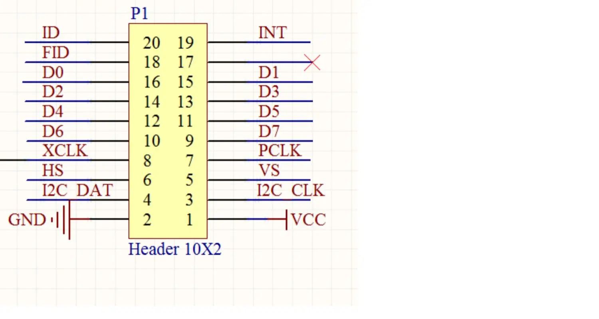
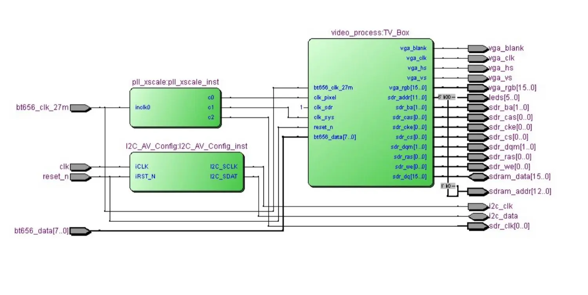

TVP5150 Decodificador de vídeo para FPGA SDRAM NTSC PAL Señales de vídeo decodificación cámara de entrada AV analógica pantalla VGA

Parámetros de especificación: Admite datos de vídeo NTSC, PAL (m) (B, D, G, H, I, M, N), Pal60

Bajo consumo de energía: <150mW

Conversión A/D: admite conversión A/D de 9 bits de alta velocidad y el host puede controlar el control de brillo, contraste, saturación y tono de color.

Velocidad de datos de salida programable -Píxel cuadrado de 12,2727 MHz (NTSC)

-14,75 micrófonos cuadrados (PAL)

-13.5 MHz ITU-R BT.601 (NTSC y PAL)

Entrada de vídeo: el canal de entrada analógica puede aceptar dos entradas de vídeo CVBS (acoplamiento de CA, 0,1 uF)

Se pueden conectar puertos de entrada analógica: dos entradas de vídeo compuesto seleccionables, una entrada s-Video

Formato de salida de vídeo programable estándar: ITU-R BT.656, sincronización integrada de 8 bits 4:2, sincronización discreta de -8 bits 4:2:2

TVP5150 es un módulo de decodificación de video de alto rendimiento que puede detectar y convertir automáticamente señales de video analógicas estándar. Por ejemplo, NTSC PAL y SECAM Conviértalo al formato de imagen 4:2 y envían los datos usando el BT ITU-R de 8 bits.La interfaz estándar 656 TVP5150 es compatible con una amplia gama de dispositivos de video, como reproductores de DVD y decodificadores.Una cámara CCD típica es una cámara de imagen de marcha atrás.

Proporcionar ejemplos:

Un sistema de adquisición de imágenes de cámara CCD basado en una cámara CCD FPGA es una cámara retrovisora de automóvil de uso común en Internet.Su interfaz es compatible con interfaces de cámara de varias placas de desarrollo en el mercado. El chip TVP5150 de la empresa TI es un decodificador PAL clásico ADI que también tiene chips similares.Siento que en términos de dispositivos analógicos, todavía es NB de TI.El proyecto fue protegido desde la placa de desarrollo DE2 y puede ejecutarse en nuestra placa de desarrollo CP611V.Incluye decodificación de formato ITU_656, conversión de formato de imagen YCbCr a RGB, etc.

PD: Los efectos y efectos de las cámaras CMOS y CCD no están del mismo nivel, y las cámaras CCD tienen efectos significativamente mejores.Este producto actualmente solo proporciona rutinas FPGA y no tiene rutinas STM32.Algunos internautas del grupo también lo han transmitido con éxito a STM32 y otras plataformas ARM.Por favor recójalo usted mismo.

Compatible con el modo de cámara universal

En segundo lugar, la rutina de prueba

Las pruebas de la placa de desarrollo, con rutinas, también pueden realizarse de forma autónoma.

Recursos requeridos: FPGA+SDRAM+VGA (demonstrucción de placa de desarrollo CP611V)

